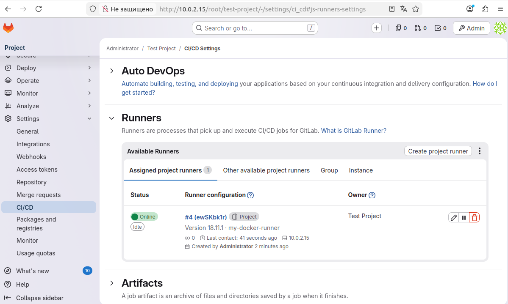
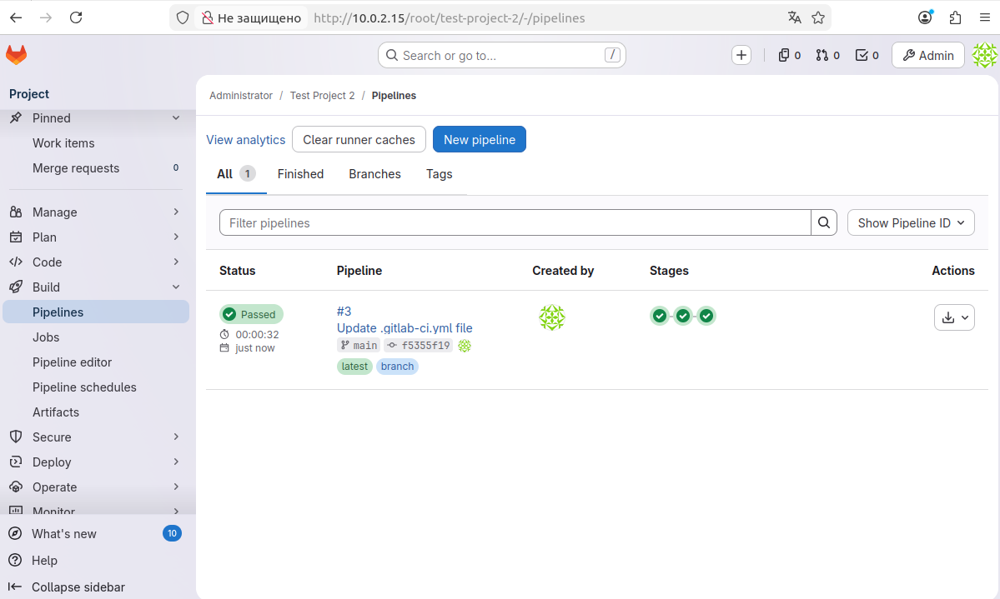

# Домашнее задание к занятию "8-03: GitLab CI/CD" - Kalinin Andrey
---

## Задание 1: развернуть GitLab, создать проект, зарегистрировать GitLab Runner в режиме Docker

**Решение:**

1. На локальной виртуальной машине (Ubuntu в VirtualBox) установлен GitLab CE.
2. Создан проект `Test Project` (пустой репозиторий).
3. Зарегистрирован раннер с исполнителем `docker`, привязанный к проекту.
4. Раннер успешно подключился и имеет статус **online**.

**Скриншот настроек раннера в проекте GitLab:**



---

## Задание 2

GitLab-проект: `http://10.0.2.15/root/test-project-2`

Файл `.gitlab-ci.yml` (лежит в корне репозитория):

```yaml
stages:
  - build
  - test
  - deploy

job_build:
  stage: build
  script:
    - echo "Сборка проекта..."
    - mkdir build
    - echo "Артефакт" > build/artifact.txt
  artifacts:
    paths:
      - build/

job_test:
  stage: test
  script:
    - echo "Тестирование..."
    - test -f build/artifact.txt && echo "Тест пройден" || exit 1

job_deploy:
  stage: deploy
  script:
    - echo "Развертывание..."
    - cat build/artifact.txt
    - echo "Деплой успешен"

**Скриншот Pipeline:**



*Дата выполнения: 01.05.2026*
